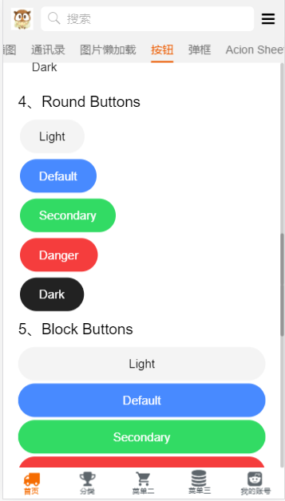

# vue-case

> A Vue.js project

## 项目构建启动

在此之前建议先单独安装node-sass, 我在安装过程中遇到N多坑，如果你也遇到，可参照（https://www.v2ex.com/t/361746  https://www.jianshu.com/p/145cc862ceec ） 解决


``` bash
# install dependencies
cnpm install

# serve with hot reload at localhost:8080
npm run dev

# build for production with minification
npm run build

# build for production and view the bundle analyzer report
npm run build --report

# run unit tests
npm run unit

# run e2e tests
npm run e2e

# run all tests
npm test
```

# 技术栈
> [vue.js](https://cn.vuejs.org/) 构建用户界面的 MVVM 框架，核心思想是：数据驱动、组件系统。

> [vue-cli](https://www.npmjs.com/package/vue-cli) 是vue的脚手架工具，目录结构、本地调试、代码部署、热加载、单元测试。

> [vue-router](https://router.vuejs.org/zh-cn/) 是官方提供的路由器，使用vue.js构建单页面应用程序变得轻而易举。

> [vue-resource](https://www.npmjs.com/package/vue-resource) 请求数据，服务器通讯，官方推荐[axios](https://www.npmjs.com/package/axios)请求数据，本项目后期改用[axios](https://www.npmjs.com/package/axios)。

> [vuex](https://vuex.vuejs.org/zh-cn/) 是一个专为 vue.js 应用程序开发的状态管理模式，简单来说Vuex就是管理数据的。

## 效果展示



